# User Interaction Flow Schema

## High-Level Architecture

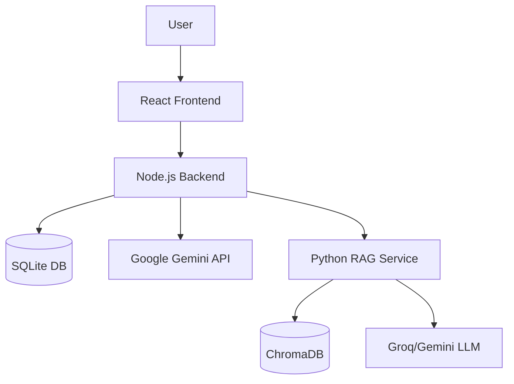

## Authentication Flow

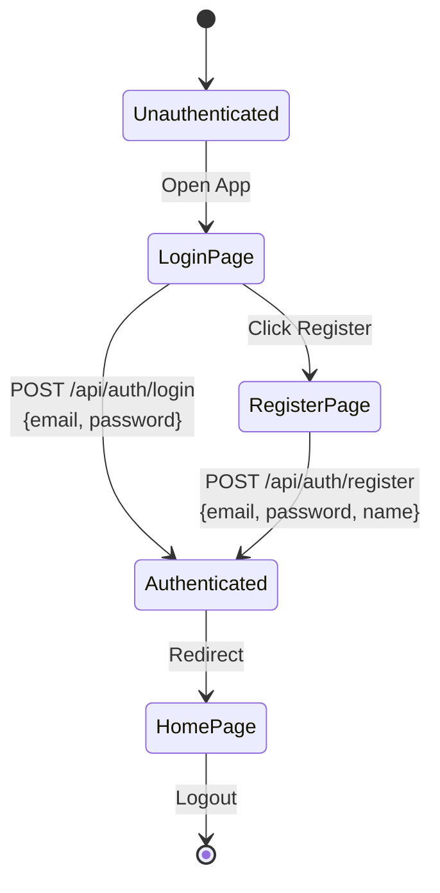

## Complete User Journey

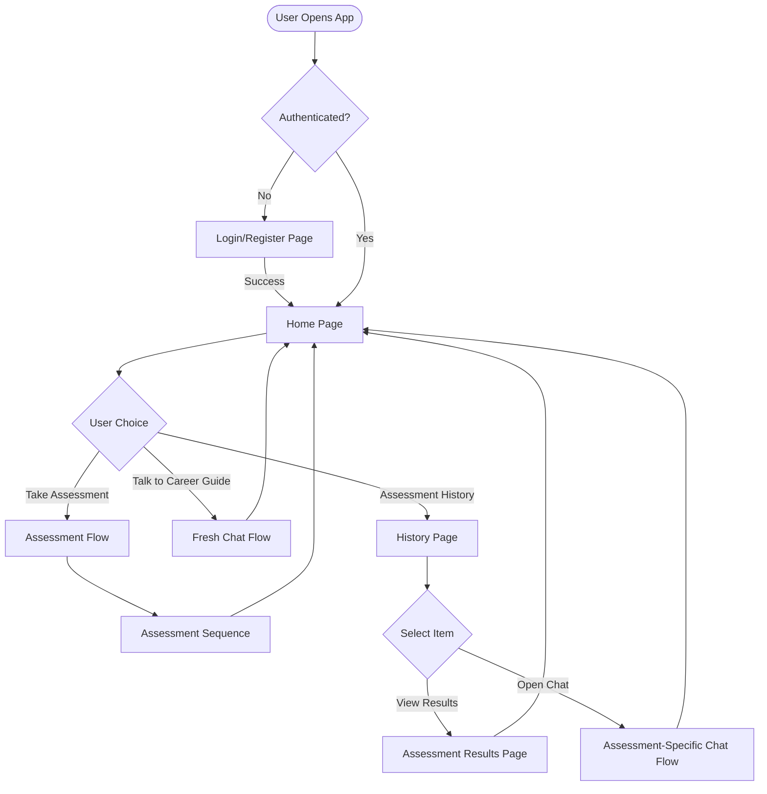

## Assessment Flow (Detailed)

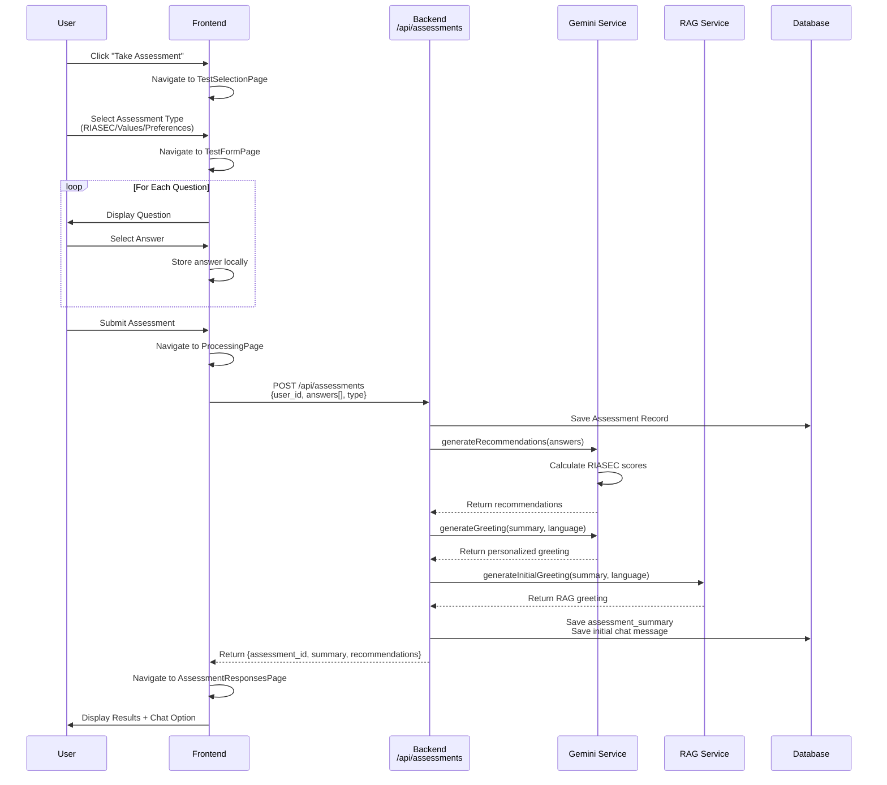

## Fresh Chat Flow (No Context)

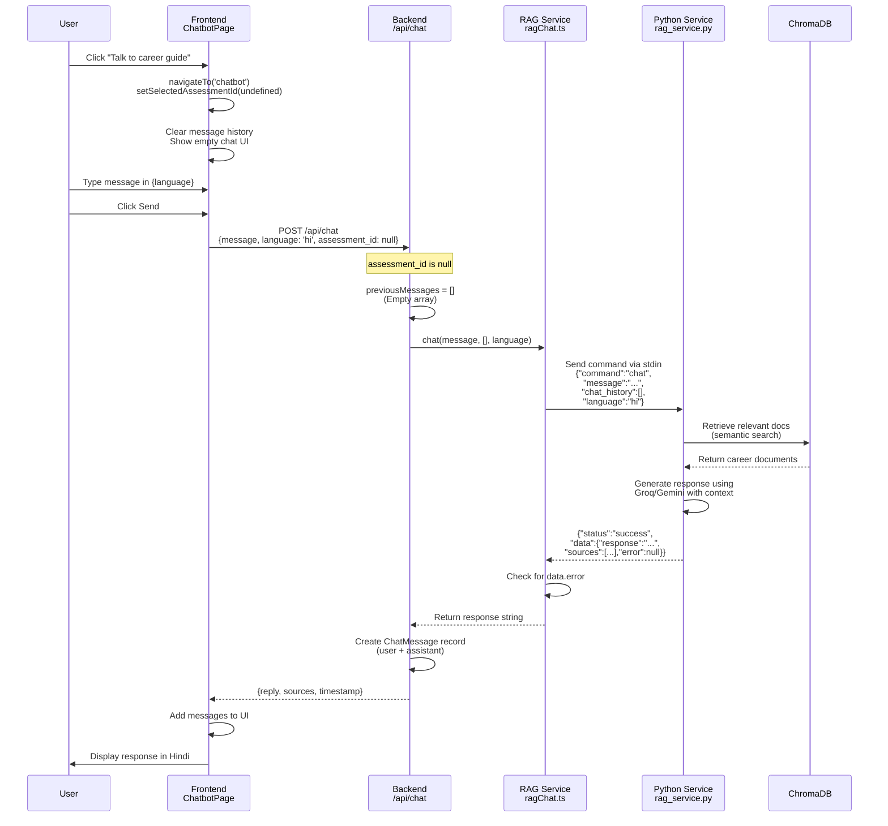

## Assessment-Specific Chat Flow (With Context)

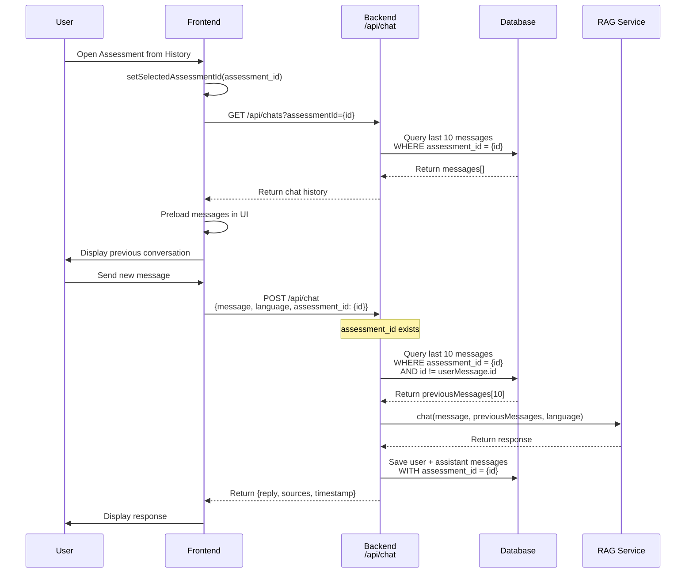

## Language Change Flow

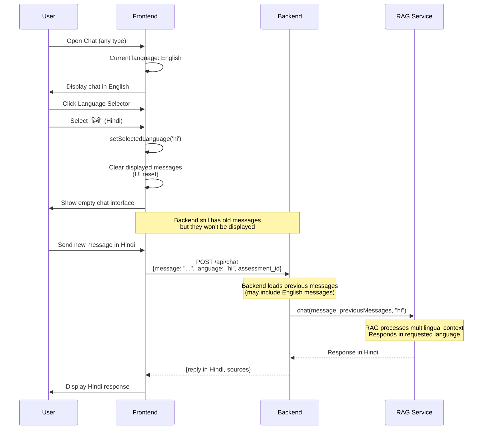

## Error Handling Flow

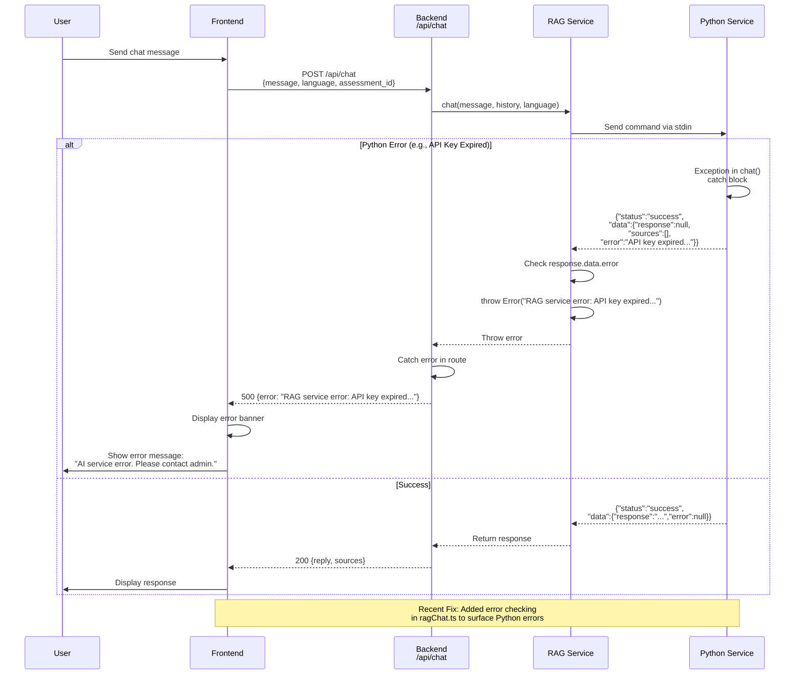

## State Diagram: Chat Context Management

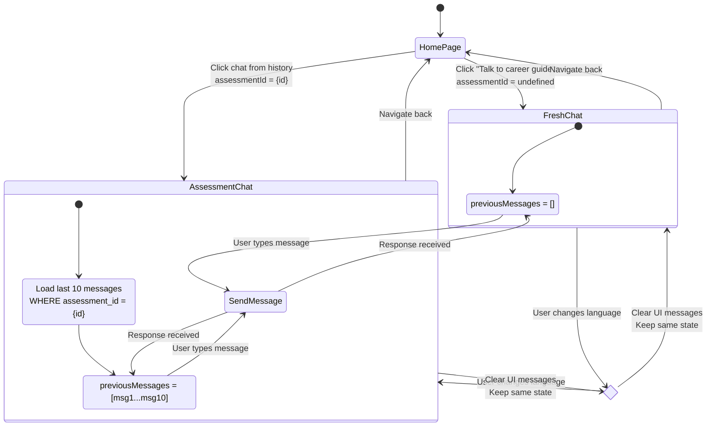

## API Endpoints Summary

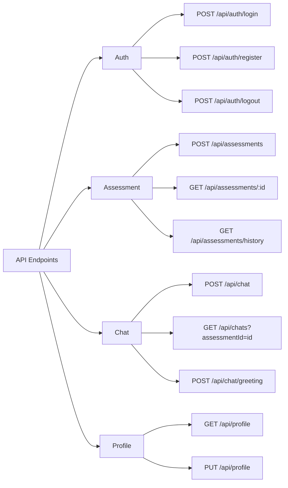

## Data Flow: Message Storage

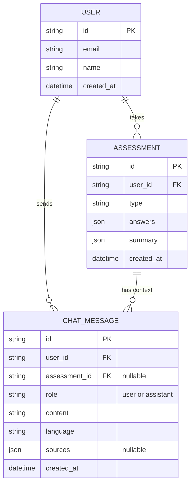

## Key Architectural Decisions

### Context Isolation Rules

| Scenario        | assessment_id  | previousMessages | Description                           |
| --------------- | -------------- | ---------------- | ------------------------------------- |
| Fresh Chat      | `null`         | `[]` (empty)     | No context passed to RAG              |
| Assessment Chat | `{uuid}`       | Last 10 from DB  | Filtered by exact assessment_id       |
| Language Change | Same as before | Same as before   | Frontend clears UI, backend unchanged |

### Error Propagation Chain

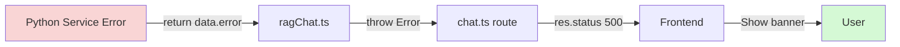

## File-to-Flow Mapping

| Flow Step         | Frontend File          | Backend File           | Service File                 |
| ----------------- | ---------------------- | ---------------------- | ---------------------------- |
| Authentication    | `LoginPage.tsx`        | `routes/auth.ts`       | -                            |
| Assessment Submit | `TestFormPage.tsx`     | `routes/assessment.ts` | `services/gemini.ts`         |
| Fresh Chat        | `ChatbotPage.tsx`      | `routes/chat.ts`       | `services/ragChat.ts`        |
| Assessment Chat   | `ChatbotPage.tsx`      | `routes/chat.ts`       | `services/ragChat.ts`        |
| Language Change   | `LanguageSelector.tsx` | -                      | -                            |
| Navigation        | `App.tsx` (navigateTo) | -                      | -                            |
| RAG Processing    | -                      | `services/ragChat.ts`  | `services/rag_service.py`    |
| Error Handling    | All components         | All routes             | `ragChat.ts` (lines 323-327) |

## Technical Implementation Notes

### Frontend State Management (`App.tsx`)

```typescript
// Context isolation for fresh chat
if (page === "chatbot" && assessmentId === undefined) {
  setSelectedAssessmentId(undefined); // Clear for fresh chat
} else if (assessmentId !== undefined) {
  setSelectedAssessmentId(assessmentId);
}
```

### Backend Context Filtering (`routes/chat.ts`)

```typescript
// Empty array for fresh chat, last 10 for assessment chat
const previousMessages = assessment
  ? await prisma.chatMessage.findMany({
      where: {
        user_id: userId,
        assessment_id: assessment.id,
        id: { not: userMessage.id },
      },
      orderBy: { created_at: "desc" },
      take: 10,
    })
  : []; // No context for general chat
```

### RAG Service Error Handling (`ragChat.ts`)

```typescript
// Check for Python-level errors first
if (response.data && response.data.error) {
  throw new Error(`RAG service error: ${response.data.error}`);
}

if (response.data && response.data.response) {
  return response.data.response;
}

throw new Error("Invalid chat response from RAG service");
```

### Python Service Response Structure (`rag_service.py`)

```python
# Success case
return {
    "response": response,
    "sources": sources,
    "error": None
}

# Error case
return {
    "response": None,
    "sources": [],
    "error": error_msg
}
```

## Payload Schemas

### Chat Request

```json
{
  "message": "string (required)",
  "language": "en|hi|te|ta|bn|gu (required, default: en)",
  "assessment_id": "uuid|null (optional)"
}
```

### Chat Response (Success)

```json
{
  "reply": "string",
  "sources": [
    {
      "title": "string",
      "chunk_index": 0,
      "snippet": "string (first 250 chars)"
    }
  ],
  "timestamp": "2025-11-19T10:30:00.000Z"
}
```

### Chat Response (Error)

```json
{
  "error": "string (error message)"
}
```

### Assessment Submission

```json
{
  "type": "riasec|values|preferences",
  "answers": [{ "question_id": "string", "answer": "string" }]
}
```

### Assessment Response

```json
{
  "assessment_id": "uuid",
  "summary": "string (assessment summary for RAG context)",
  "recommendations": [
    {
      "career_name": "string",
      "match_percentage": 85,
      "reasoning": "string"
    }
  ],
  "scores": {
    "RIASEC": {
      "realistic": 7.5,
      "investigative": 8.2,
      ...
    }
  }
}
```

## Environment Configuration

### Required Environment Variables

```env
# Backend (.env)
GEMINI_API_KEY=your_gemini_api_key
GOOGLE_API_KEY=your_gemini_api_key
RAG_PROVIDER=google  # or 'groq'
HUGGINGFACEHUB_API_TOKEN=your_hf_token
GROQ_API_KEY=your_groq_api_key  # if using Groq
JWT_SECRET=your_secret_key
DATABASE_URL=file:./db.sqlite3
FRONTEND_URL=http://localhost:5173
```

### Service Initialization

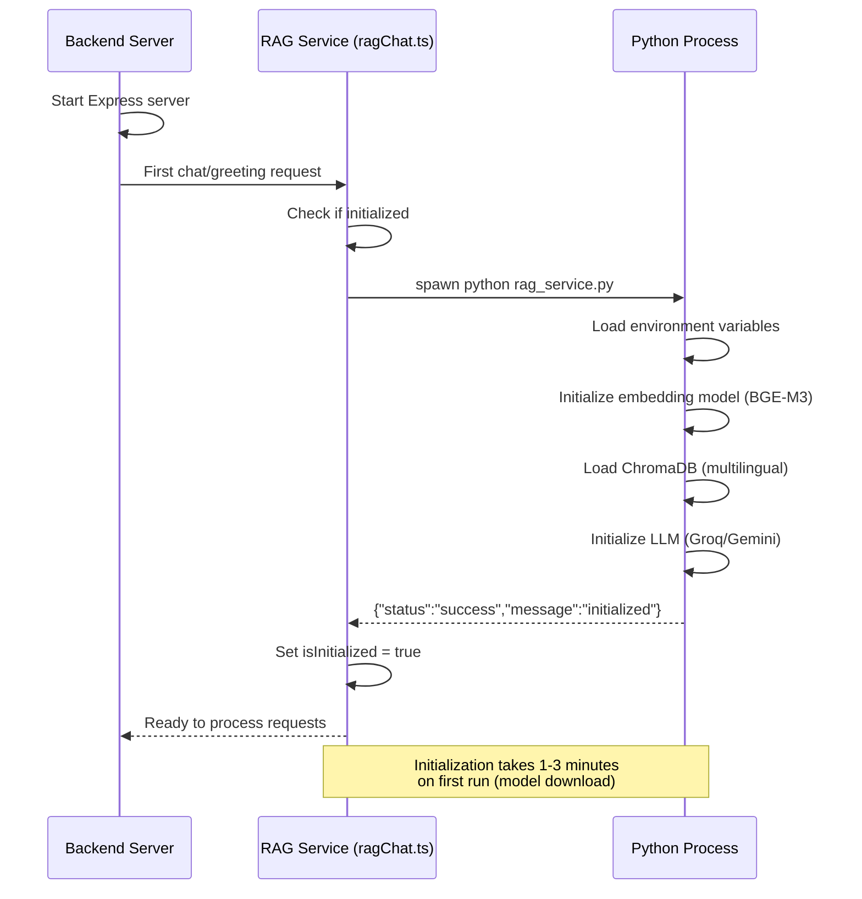
